# MTA Subway Hourly Ridership

**Nama Kelompok:** Kelompok Smile  
**Anggota:**  
- Muhammad Abil Khoiri (101032330094)  
- Firdaus Arif Ramadhani (101032300131)  

**Topik Project:** Analisis dan Prediksi Volume Kepadatan Penumpang Kereta Bawah Tanah (*MTA Subway Hourly Ridership*) Menggunakan Integrasi Data *Real-Time* GTFS  

**Link Project:**  
- GitHub Repository: https://github.com/fxrdhan/mta-subway-bigdata  
- Sumber Data *Batch*: https://data.ny.gov/d/5wq4-mkjj  
- Sumber Data *Streaming*: https://api.mta.info/ (*MTA Real-Time GTFS Feed*)  

---

## I. Latar Belakang

Jaringan kereta bawah tanah (*subway*) *Metropolitan Transportation Authority* (MTA) New York City melayani jutaan komuter setiap hari melalui 428 kompleks stasiun. Tingginya volume mobilitas harian memicu risiko penumpukan penumpang (*overcrowding*) di peron dan ketidakefisienan alokasi frekuensi armada kereta. Selain itu, masa transisi sistem tiket dari kartu magnetik (*MetroCard*) ke pembayaran nirsentuh digital (*OMNY*) menuntut penataan gerbang masuk (*turnstile*) yang adaptif.

Melalui integrasi data historis volume penumpang per jam (*batch data*) dan pemantauan pergerakan armada secara langsung melalui *General Transit Feed Specification Realtime* (GTFS-RT *streaming*), sistem dapat memprediksi lonjakan komuter, mengkorelasikan keterlambatan kereta dengan kepadatan stasiun, serta mengoptimalkan operasional transit secara presisi.

---

## II. 5W1H

### What:
Analisis pola pergerakan, peramalan (*forecasting*) kepadatan penumpang per jam (*hourly ridership*), dan pemantauan keterlambatan armada kereta *real-time* pada 428 kompleks stasiun *subway* MTA New York City menggunakan *pipeline Big Data* dan *Machine Learning*.

### Why:
1. Memitigasi risiko penumpukan komuter berbahaya (*crowd safety*) di peron stasiun pada jam sibuk (*rush hour*).
2. Menyesuaikan frekuensi perjalanan kereta secara dinamis berbasis kebutuhan riil penumpang untuk efisiensi operasional dan energi.
3. Memetakan kecepatan adopsi tiket nirsentuh (*OMNY*) terhadap kartu fisik (*MetroCard*) guna optimalisasi fasilitas gerbang stasiun.

### Who:
1. *Metropolitan Transportation Authority* (MTA) dan *New York City Transit* (NYCT) sebagai operator utama pengambil kebijakan armada.
2. *New York City Department of Transportation* (NYC DOT) untuk integrasi antarmoda transportasi perkotaan.
3. Manajer Operasional dan Petugas Keamanan Stasiun untuk pengendalian kerumunan di lapangan.
4. Komuter dan masyarakat pengguna transportasi massal Kota New York.

### Where:
1. Data *Batch*: Portal Resmi Open Data Pemerintah Negara Bagian New York ([data.ny.gov](https://data.ny.gov/d/5wq4-mkjj)), diakses via SODA API ([data.ny.gov/resource/5wq4-mkjj.json](https://data.ny.gov/resource/5wq4-mkjj.json)).
2. Data *Streaming*: Portal Pengembang Resmi MTA ([api.mta.info](https://api.mta.info/)) berbasis spesifikasi protokol [GTFS Realtime](https://gtfs.org/realtime/).

### When:
1. Periode Data Historis (*Batch*): 1 Januari 2025 hingga September 2026 (terdiri dari 45.243.727 baris data terverifikasi tanpa *null*).
2. Pembaruan Data (*Streaming*): Data posisi armada (*Vehicle Positions*) dan estimasi kedatangan/keterlambatan (*Trip Updates*) yang mengalir setiap 30 detik secara kontinu.

### How:
1. *Pipeline & Ingestion*:
   - *Batch Processing*: Ekstraksi data via DuckDB dan Apache Arrow dengan format penyimpanan terkompresi Apache Parquet (zstd), mereduksi 45,2 juta baris menjadi 125 MB.
   - *Streaming Ingestion*: Penarikan *feed* GTFS-RT setiap 30 detik menggunakan Python Kafka Producer menuju *topic* Kafka (`mta-gtfs-stream`) untuk konsumsi *real-time* via Spark Streaming.
2. *Storage Management*:
   - SQL (PostgreSQL): Menyimpan data tabular agregat per stasiun, *Borough*, dan master rute perjalanan.
   - NoSQL (MongoDB): Menyimpan *payload* log peristiwa (*event*) GTFS-RT mentah dan metadata geospasial stasiun.
3. *Machine Learning*:
   - Regresi: Prediksi volume penumpang jam berikutnya ($\log(1 + \text{ridership})$) per stasiun.
   - Klasifikasi: Identifikasi kondisi jam sibuk (*Peak* vs *Off-Peak*) serta deteksi anomali keterlambatan jalur kereta.
   - *Clustering* (K-Means): Segmentasi 428 stasiun berdasarkan profil fluktuasi komuter (kawasan perkantoran, pemukiman, atau transit wisata).

## III. Data Wrangling – *Gathering Data*

Bagian ini mendokumentasikan tahap pengumpulan data (*gathering*) untuk dataset *MTA Subway Hourly Ridership*. Seluruh prosesnya dijalankan di Google Colab dan dijelaskan langkah demi langkah pada notebook proyek (bagian **MINGGU-3**).

- Notebook Google Colab: https://colab.research.google.com/drive/1GU64Yx-8Bq7PgxiG-lg5t9dnfb1lKIH5
- Notebook lengkap dengan output eksekusi: [`notebooks/MTA_Subway_Hourly_Ridership.ipynb`](notebooks/MTA_Subway_Hourly_Ridership.ipynb)
- Salinan kode notebook di repositori: [`notebooks/minggu3_gathering_data.ipynb`](notebooks/minggu3_gathering_data.ipynb)
- Laporan tugas Minggu 3: [`docs/TugasMinggu3_BIG-DATA_TK47G06_101032330094-101032300131.pdf`](docs/TugasMinggu3_BIG-DATA_TK47G06_101032330094-101032300131.pdf) ([DOCX](docs/TugasMinggu3_BIG-DATA_TK47G06_101032330094-101032300131.docx))
- Dataset final: `mta_subway_hourly_ridership_2025-01_2026-09.parquet` (124,2 MB). Berkas ini tidak di-*commit* ke repositori karena ukurannya mendekati batas file GitHub (100 MB) dan diserahkan sebagai berkas terpisah.

### 1. Sumber dan Cara Memperoleh Data

| Item | Keterangan |
|---|---|
| Nama dataset | MTA Subway Hourly Ridership: Beginning 2025 |
| ID dataset | `5wq4-mkjj` |
| Pemilik | *Metropolitan Transportation Authority* (MTA) |
| Portal | [data.ny.gov/d/5wq4-mkjj](https://data.ny.gov/d/5wq4-mkjj) (NY Open Data) |
| Endpoint data | `https://data.ny.gov/resource/5wq4-mkjj` (format `.json` dan `.csv`, SODA API) |
| Endpoint metadata | `https://data.ny.gov/api/views/5wq4-mkjj.json` |
| Frekuensi pembaruan | Mingguan (menurut metadata portal) |
| Lisensi | Kolom lisensi pada metadata portal kosong, sehingga tidak dinyatakan eksplisit |

Data diperoleh langsung dari sumber utama lewat **SODA API** menggunakan permintaan HTTP GET (pustaka `requests`) tanpa autentikasi. Pengambilan lewat API dipilih dibanding unduhan manual karena data terus diperbarui dan API mendukung penyaringan (`$where`), pengurutan (`$order`), pembagian halaman (`$limit`, `$offset`), dan agregasi di sisi server (`$select`, `$group`). Fitur-fitur ini diperlukan untuk memfiksasi *snapshot* dan memvalidasi hasilnya.

Sumber lain yang dipertimbangkan:

- **MTA Subway Hourly Ridership: 2020-2024** (`wujg-7c2s`, 120.855.567 baris) memiliki skema identik dan menyambung tanpa celah dengan dataset utama (31 Desember 2024 pukul 23:00 lalu 1 Januari 2025 pukul 00:00). Dataset ini hanya diperiksa metadatanya dan tidak dimasukkan karena ruang lingkup proyek difiksasi pada data 2025 dan seterusnya.
- **Feed GTFS-RT MTA** (sumber *streaming*) tidak termasuk dalam dataset yang difiksasi pada tahap ini dan akan dikumpulkan pada tahap *streaming*.

### 2. Karakteristik Awal Dataset

| Karakteristik | Nilai |
|---|---|
| Granularitas | 1 baris = jam × kompleks stasiun × metode pembayaran × kelas tarif |
| Periode (*snapshot*) | 1 Januari 2025 00:00 s.d. 16 September 2026 23:00 (624 hari) |
| Jumlah baris | 45.243.727 |
| Jumlah kolom | 12 |
| Kompleks stasiun | 428 |
| Moda transportasi | 3: *subway* (99,27% baris), *Staten Island Railway* (0,39%), *tram* (0,35%) |
| *Borough* | 5: Brooklyn (35,34%), Manhattan (30,90%), Queens (17,37%), Bronx (16,00%), Staten Island (0,39%) |
| Metode pembayaran | OMNY (55,41% baris; 87,7% total penumpang) dan MetroCard (44,59% baris) |
| Kelas tarif | 12 kategori |
| `ridership` | min 1; median 7; rata-rata 49,49; persentil ke-95 188; maks 23.510; total 2.238.986.651 |
| `transfers` | min −30; median 0; rata-rata 2,47; maks 2.556; total 111.767.861 |
| Nilai kosong (*null*) | 0 pada seluruh kolom |
| Ukuran | 374,3 MB (624 file harian) dan 124,2 MB (1 file final), format Parquet zstd |

| No | Kolom | Tipe (Arrow) | Keterangan |
|:-:|---|---|---|
| 1 | `transit_timestamp` | `timestamp[us]` | Waktu lokal New York, dibulatkan ke bawah ke jam terdekat, tanpa zona waktu |
| 2 | `transit_mode` | `string` | `subway`, `staten_island_railway`, atau `tram` |
| 3 | `station_complex_id` | `string` | Pengenal kompleks stasiun |
| 4 | `station_complex` | `string` | Nama kompleks stasiun beserta rute |
| 5 | `borough` | `string` | Wilayah administratif |
| 6 | `payment_method` | `string` | `omny` atau `metrocard` |
| 7 | `fare_class_category` | `string` | Kelas tarif |
| 8 | `ridership` | `float64` | Jumlah penumpang masuk |
| 9 | `transfers` | `float64` | Subset `ridership` yang masuk lewat transfer gratis |
| 10 | `latitude` | `float64` | Lintang stasiun |
| 11 | `longitude` | `float64` | Bujur stasiun |
| 12 | `georeference` | `string` | Titik lokasi format WKT `POINT (bujur lintang)` |

Catatan awal untuk tahap *assessing* dan *cleaning* (belum diperbaiki pada tahap ini): 226 baris `transfers` bernilai negatif, satu jam tidak muncul pada rentang waktu (2026-03-08 02:00), satu kompleks stasiun (*St George*, ID 501) tercatat dengan dua moda, dan `transit_timestamp` tidak memuat zona waktu.

### 3. Tahapan Gathering

| No | Tahap | Metode | Bagian notebook | Hasil |
|:-:|---|---|:-:|---|
| 1 | Verifikasi sumber dan metadata | `GET /api/views/5wq4-mkjj.json` | 4.1 | Nama, pemilik, frekuensi pembaruan, tipe kolom |
| 2 | Melihat bentuk mentah respons | `GET .json` dan `.csv` dengan `$limit=3` | 4.2 | Angka dikirim sebagai teks dan `georeference` berupa objek GeoJSON pada JSON |
| 3 | Menetapkan skema target | Skema `pyarrow` eksplisit | 4.3 | 12 kolom bertipe tetap |
| 4 | Fiksasi *snapshot* | `count(*)` dan `max(transit_timestamp)` di server | 5.1 | *Cutoff* 2026-09-16 23:00; 45.243.727 baris |
| 5 | Rencana pengambilan | `GROUP BY` tanggal di server | 5.2 | Jumlah baris untuk 624 hari |
| 6 | Pengambilan per hari | CSV per halaman, 6 unduhan paralel, *retry* dengan *backoff* | 6 | 624 file Parquet harian |
| 7 | Penggabungan | *Concat* harian → bulanan → final (DuckDB) | 7 | 21 file bulanan dan 1 file final |
| 8 | Pemeriksaan struktur awal | SQL DuckDB dan `pandas` | 8 | Dimensi, tipe, *null*, sebaran, statistik |
| 9 | Validasi | Perbandingan agregat harian dengan server (`pd.merge`) | 9 | 10 dari 10 pemeriksaan lulus |

Rincian penting pada tahap pengambilan:

- **Endpoint CSV dengan skema tetap.** CSV dibaca `pyarrow` dengan tipe kolom yang ditentukan di awal, sehingga seluruh potongan seragam.
- **Satu hari per pekerjaan.** Filter waktu membatasi setiap permintaan ke satu hari dan tidak melewati *cutoff*. Bila hasilnya lebih dari 500.000 baris, data diambil per halaman dengan urutan `:id` yang deterministik.
- **Validasi per hari.** Jumlah baris hasil unduhan harus sama dengan jumlah dari server. Bila berbeda, pengambilan diulang hingga tiga kali.
- **Aman dilanjutkan.** Hari yang filenya sudah ada dengan jumlah baris benar dilewati, sehingga sesi Colab yang terputus dapat dilanjutkan tanpa mengunduh ulang.

### 4. Dataset dan File yang Digunakan

| Lapisan | Lokasi (pada Colab) | Isi | Ukuran |
|---|---|---|---|
| Sumber | `data.ny.gov/resource/5wq4-mkjj` | Data asli di server | – |
| Harian | `/content/mta_subway/01_harian/YYYY-MM/YYYY-MM-DD.parquet` | 624 file | 374,3 MB |
| Bulanan | `/content/mta_subway/02_bulanan/year=YYYY/month=MM/part-0.parquet` | 21 file, terurut menurut kunci | ≈ 124,7 MB |
| **Final** | `/content/mta_subway/03_final/mta_subway_hourly_ridership_2025-01_2026-09.parquet` | 1 file, 45.243.727 baris × 12 kolom | 124,2 MB |

Pada repositori:

| Berkas | Keterangan |
|---|---|
| [`notebooks/MTA_Subway_Hourly_Ridership.ipynb`](notebooks/MTA_Subway_Hourly_Ridership.ipynb) | Notebook lengkap proyek beserta seluruh output eksekusi di Google Colab |
| [`notebooks/minggu3_gathering_data.ipynb`](notebooks/minggu3_gathering_data.ipynb) | Salinan kode bagian MINGGU-3 (gathering data) |
| [`docs/TugasMinggu3_BIG-DATA_TK47G06_101032330094-101032300131.pdf`](docs/TugasMinggu3_BIG-DATA_TK47G06_101032330094-101032300131.pdf) | Berkas laporan resmi tugas Minggu 3 (tersedia pula format [DOCX](docs/TugasMinggu3_BIG-DATA_TK47G06_101032330094-101032300131.docx)) |
| [`src/download_snapshot.py`](src/download_snapshot.py), [`src/soda.py`](src/soda.py) | Skrip pengambilan yang sama untuk dijalankan di komputer lokal |
| `data/final/` | Lokasi salinan lokal dataset final (tidak di-*commit* karena besar) |

Hasil pengambilan di Colab sama dengan pengambilan lokal sebelumnya (`src/download_snapshot.py`) dalam jumlah baris (45.243.727), total `ridership` (2.238.986.651), dan total `transfers` (111.767.861).

### 5. Proses Penggabungan Data

Data berasal dari satu dataset sumber, tetapi diterima dalam 624 potongan harian. Penggabungannya berupa **penggabungan vertikal** (*concat*, setara `UNION ALL`) karena seluruh potongan memiliki kolom dan tipe yang sama. *Join* tidak diperlukan karena tidak ada tabel lain yang perlu disambungkan. Operasi `pd.merge` dipakai pada tahap validasi untuk membandingkan agregat harian lokal dengan server.

1. **Halaman → hari.** Bila hasil satu hari lebih dari satu halaman (500.000 baris), halaman-halaman digabung dengan `pa.concat_tables`. Pada data ini hari terbanyak hanya 93.017 baris sehingga setiap hari cukup satu halaman.
2. **Contoh `pd.concat`.** Tiga hari pertama digabung dengan `pd.concat` untuk memperlihatkan operasinya (74.914 + 77.324 + 78.251 = 230.489 baris; lihat notebook bagian 7.1).
3. **Harian → bulanan.** Seluruh file harian pada satu bulan dibaca dengan pola `*.parquet`, diurutkan menurut kunci (`transit_timestamp`, `station_complex_id`, `payment_method`, `fare_class_category`), dan ditulis sebagai satu file Parquet. Jumlah baris tiap bulan divalidasi terhadap server.
4. **Bulanan → final.** Ke-21 file bulanan disambung berurutan menjadi satu file. Pengurutan ulang tidak diperlukan karena tiap file sudah terurut dan rentang waktu antarbulan tidak tumpang tindih.

DuckDB dipakai untuk data penuh karena membaca Parquet secara kolumnar dan dapat memakai disk bila memori tidak cukup, sedangkan `pd.concat` pada 45 juta baris akan membebani RAM Colab.

Hasil penggabungan harian → bulanan. Jumlah baris setiap bulan sama dengan jumlah di server.

| Bulan | Hari | Baris | Ukuran (MB) |
|:-:|:-:|--:|--:|
| 2025-01 | 31 | 2.398.982 | 6,1 |
| 2025-02 | 28 | 2.273.357 | 5,7 |
| 2025-03 | 31 | 2.599.249 | 6,7 |
| 2025-04 | 30 | 2.646.409 | 6,5 |
| 2025-05 | 31 | 2.776.119 | 6,8 |
| 2025-06 | 30 | 2.673.221 | 6,7 |
| 2025-07 | 31 | 2.711.975 | 6,8 |
| 2025-08 | 31 | 2.681.448 | 6,8 |
| 2025-09 | 30 | 2.581.490 | 6,6 |
| 2025-10 | 31 | 2.578.816 | 6,7 |
| 2025-11 | 30 | 2.341.100 | 6,3 |
| 2025-12 | 31 | 2.209.615 | 6,3 |
| 2026-01 | 31 | 1.859.429 | 5,9 |
| 2026-02 | 28 | 1.658.281 | 5,2 |
| 2026-03 | 31 | 1.840.773 | 5,8 |
| 2026-04 | 30 | 1.725.407 | 5,4 |
| 2026-05 | 31 | 1.757.938 | 5,5 |
| 2026-06 | 30 | 1.683.047 | 5,3 |
| 2026-07 | 31 | 1.731.793 | 5,5 |
| 2026-08 | 31 | 1.706.084 | 5,4 |
| 2026-09 | 16 | 809.194 | 2,7 |
| **Total** | **624** | **45.243.727** | **≈ 124,7** |

### 6. Kendala dan Cara Mengatasinya

| No | Kendala | Cara mengatasi |
|:-:|---|---|
| 1 | Ukuran data besar (45,2 juta baris) sehingga tidak praktis diambil dalam satu permintaan dan berisiko membebani memori Colab | Data dibagi per hari (624 potongan), disimpan sebagai Parquet terkompresi, dan digabung dengan DuckDB yang memproses secara kolumnar dan dapat memakai disk |
| 2 | Respons JSON mengirim seluruh angka sebagai teks dan `georeference` sebagai objek GeoJSON | Memakai endpoint CSV dengan skema `pyarrow` eksplisit, sehingga tipe kolom seragam di seluruh potongan |
| 3 | Layanan publik dapat memutus atau menolak permintaan (*timeout*, kode 429/5xx). Pada uji lokal terjadi satu `ReadTimeout` | Fungsi `soda_get` melakukan *retry* dengan jeda eksponensial (hingga 8 kali). `ReadTimeout` tersebut diulang otomatis dan berhasil. Pada run final di Colab tidak diperlukan *retry* |
| 4 | Dataset diperbarui mingguan, sehingga dua pengambilan pada waktu berbeda dapat menghasilkan dataset berbeda | *Snapshot* difiksasi dengan *cutoff* `transit_timestamp <= 2026-09-16 23:00` dan nilai acuan (jumlah baris, total `ridership`, total `transfers`) yang diverifikasi pada akhir proses |
| 5 | Kueri agregat pada server lambat (satu `count(*)` pernah memakan sekitar 30 detik) | Kueri agregat dibatasi pada empat kueri; seluruh validasi harian memakai satu kueri `GROUP BY` |
| 6 | Sesi Colab bersifat sementara sehingga file dan progres hilang saat sesi berakhir | Pengambilan bersifat *idempotent* (hari yang sudah ada dilewati; terbukti pada eksekusi ulang yang melewati seluruh 624 hari). Tersedia opsi menyalin dataset final ke Google Drive |
| 7 | Kualitas data awal: 226 baris `transfers` negatif, satu jam hilang, dan satu stasiun dengan dua moda | Tidak diubah pada tahap *gathering*. Dicatat dan dijadikan bahan tahap *assessing* dan *cleaning* |

### 7. Hasil Akhir Proses Gathering

Seluruh pemeriksaan validasi pada notebook (bagian 9.3) lulus:

| Pemeriksaan | Status |
|---|:-:|
| Baris harian = baris server (*snapshot*) | Lulus |
| Baris bulanan = baris server | Lulus |
| Baris dataset final = baris server | Lulus |
| Agregat per hari (baris, `ridership`, `transfers`) sama dengan server, 624 hari | Lulus |
| Tidak ada duplikat kunci | Lulus |
| Data terurut menurut kunci (bulanan dan final) | Lulus |
| Tidak ada nilai *null* | Lulus |
| Baris final = nilai acuan *snapshot* (45.243.727) | Lulus |
| Total `ridership` = nilai acuan (2.238.986.651) | Lulus |
| Total `transfers` = nilai acuan (111.767.861) | Lulus |

| Atribut | Nilai |
|---|---|
| File | `mta_subway_hourly_ridership_2025-01_2026-09.parquet` |
| Format | Apache Parquet (kompresi zstd) |
| Ukuran | 124,2 MB |
| Baris × kolom | 45.243.727 × 12 |
| Rentang waktu | 2025-01-01 00:00:00 s.d. 2026-09-16 23:00:00 |
| Kompleks stasiun | 428 |
| Waktu pengambilan 624 hari | 10,6 menit pada run final (6 unduhan paralel); empat kali pengambilan penuh di Colab memakan 8,6 sampai 17,4 menit, bergantung beban server |

Dataset final ini menjadi masukan tahap berikutnya, yaitu *assessing* dan *cleaning*.

### 8. Bukti Pelaksanaan di Google Colab

Seluruh gambar berikut diambil dari notebook Google Colab pada eksekusi terakhir (VM Colab baru).

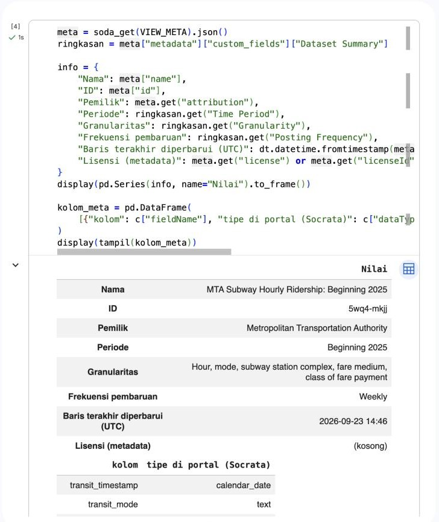
*Gambar 1. Metadata dataset dari endpoint `/api/views` (nama, pemilik, frekuensi pembaruan, lisensi kosong).*

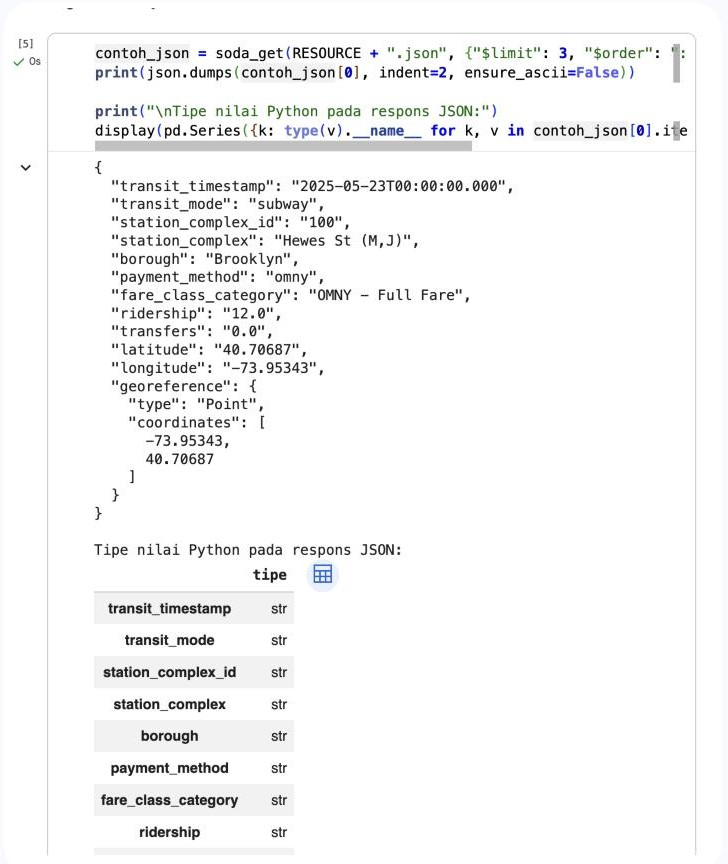
*Gambar 2. Bentuk mentah respons JSON: seluruh angka bertipe teks dan `georeference` berupa objek GeoJSON.*

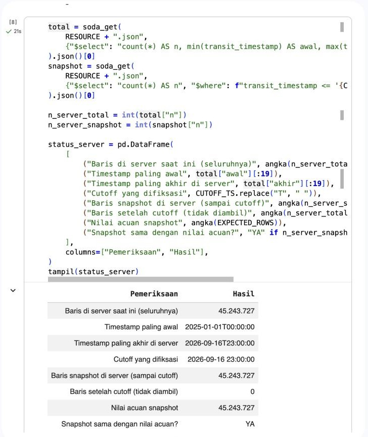
*Gambar 3. Fiksasi *snapshot*: baris di server sampai *cutoff* (45.243.727) sama dengan nilai acuan dan tidak ada baris setelah *cutoff*.*

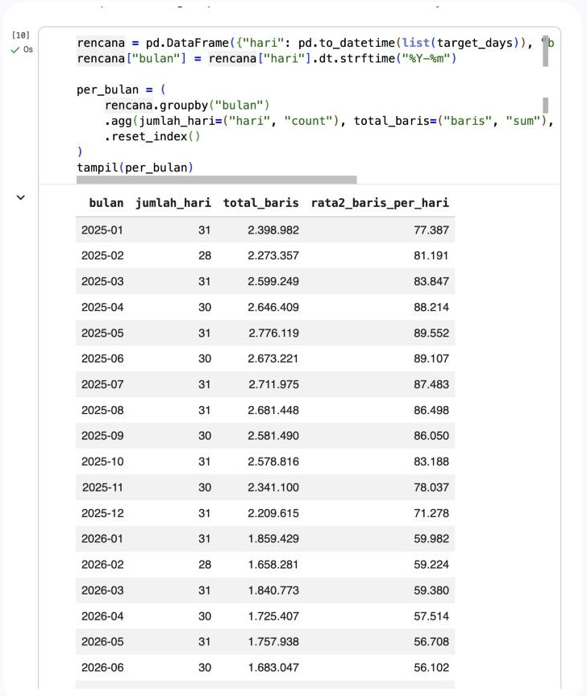
*Gambar 4. Rencana pengambilan: jumlah hari dan baris per bulan dari agregasi server.*

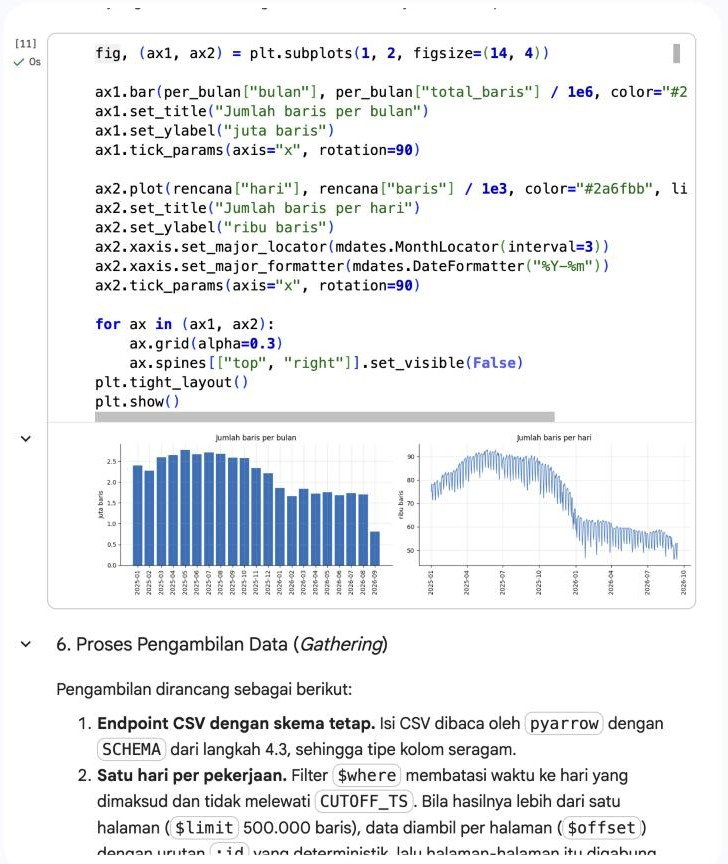
*Gambar 5. Jumlah baris per bulan dan per hari.*

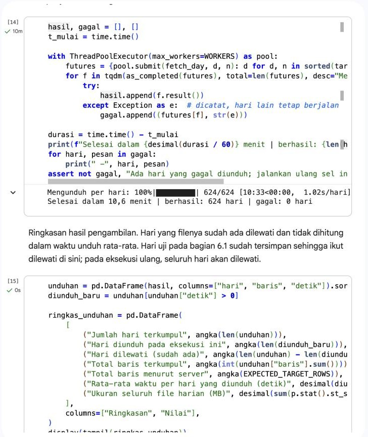
*Gambar 6. Pengambilan 624 hari secara paralel: 624 dari 624 hari berhasil dalam 10,6 menit, 0 gagal.*

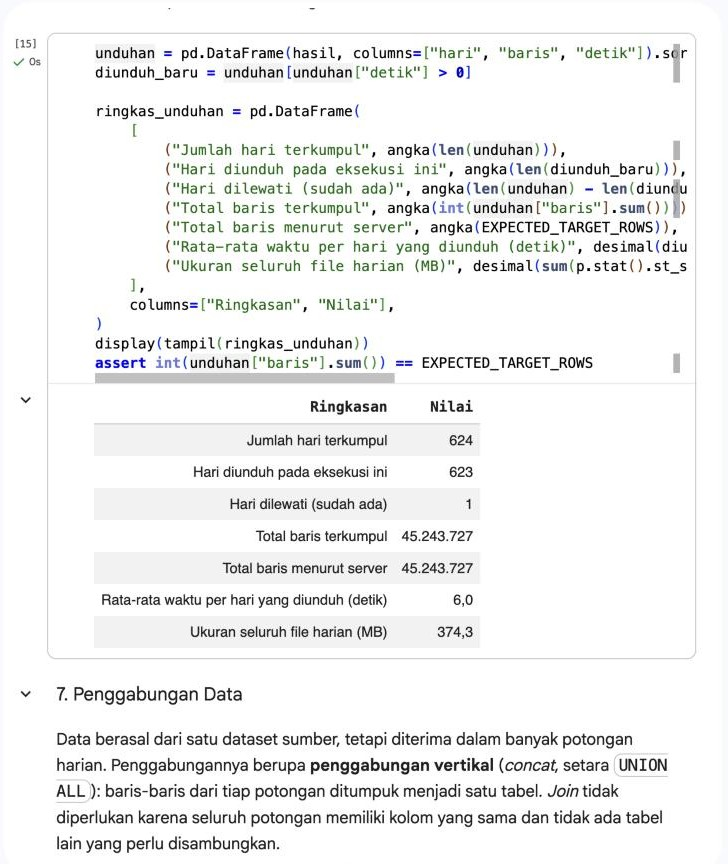
*Gambar 7. Ringkasan pengambilan: total baris terkumpul sama dengan total menurut server.*

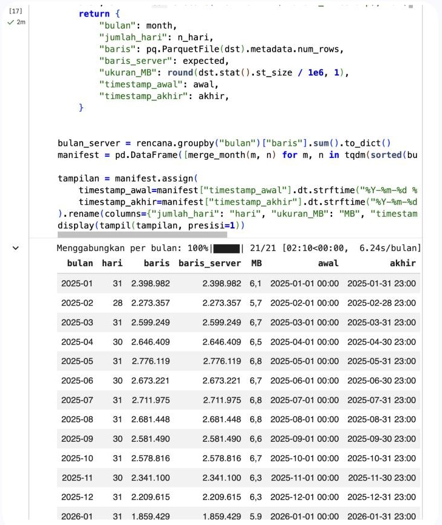
*Gambar 8. Penggabungan harian → bulanan (21 file): jumlah baris tiap bulan sama dengan server.*

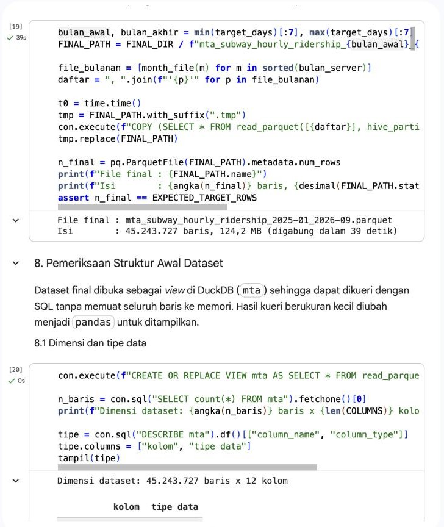
*Gambar 9. Penggabungan bulanan → satu file final.*

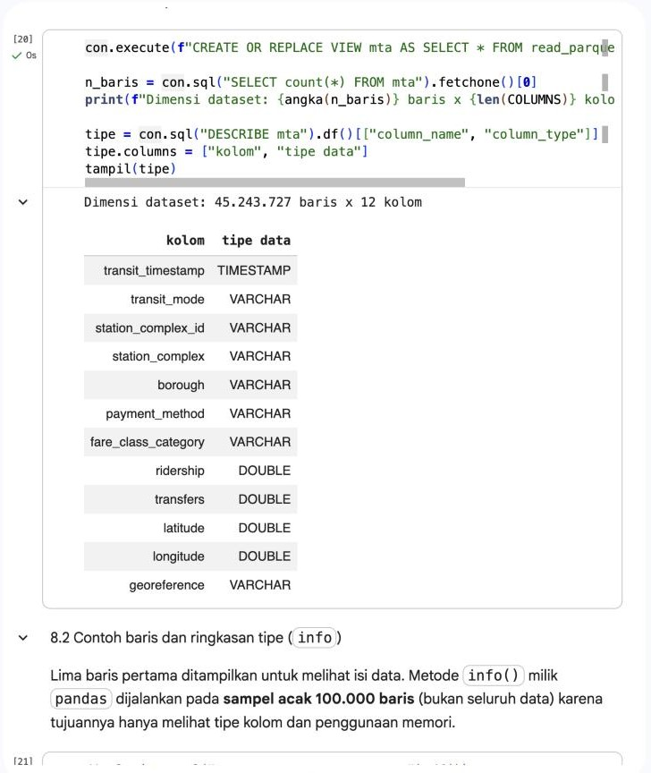
*Gambar 10. Dimensi dataset final (45.243.727 baris × 12 kolom) dan tipe data.*

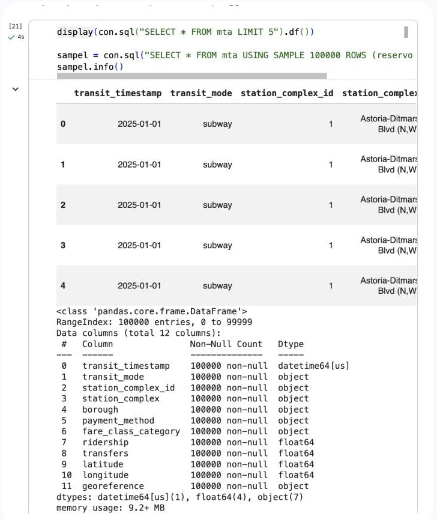
*Gambar 11. Contoh lima baris pertama dan ringkasan tipe (`info`) pada sampel acak 100.000 baris.*

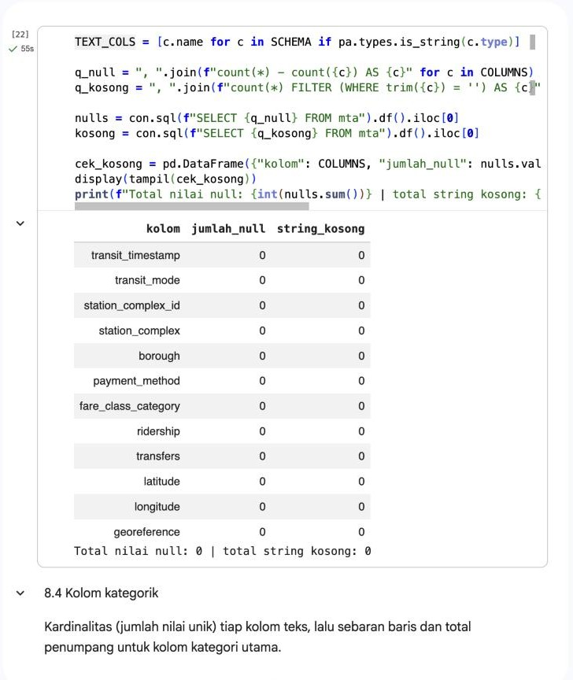
*Gambar 12. Pemeriksaan nilai kosong dan string kosong: 0 pada seluruh kolom.*

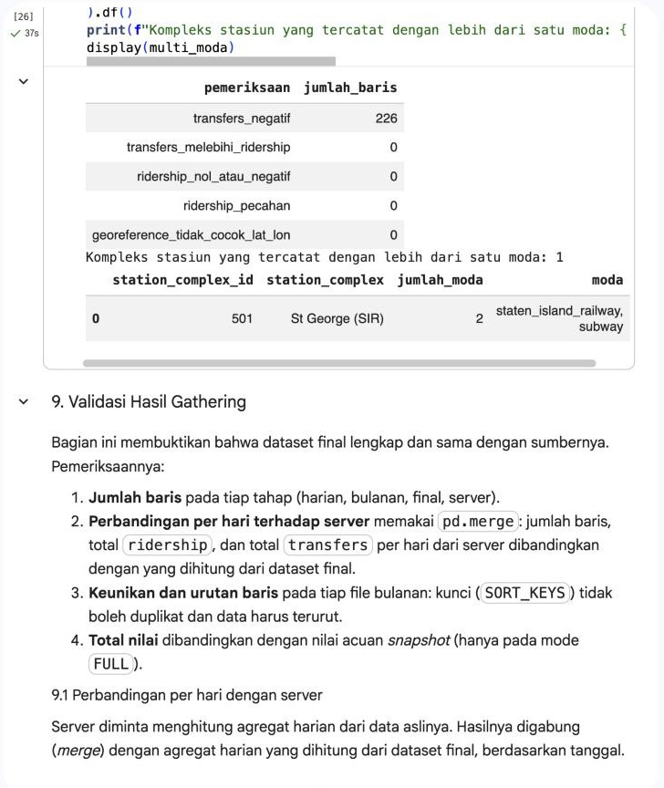
*Gambar 13. Temuan awal untuk tahap berikutnya: 226 baris `transfers` negatif dan satu stasiun dengan dua moda.*

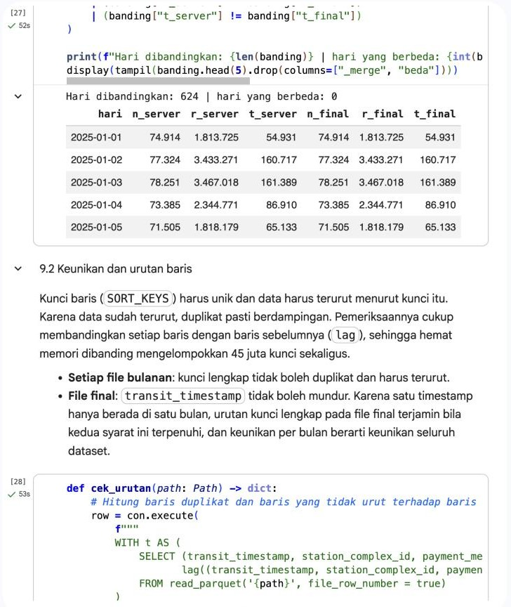
*Gambar 14. Perbandingan agregat harian dengan server: 624 hari dibandingkan, 0 hari berbeda.*

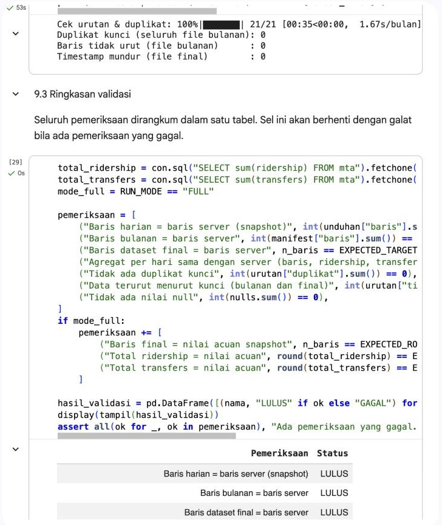
*Gambar 15. Pemeriksaan duplikat kunci dan urutan data: 0 duplikat, 0 baris tidak urut.*

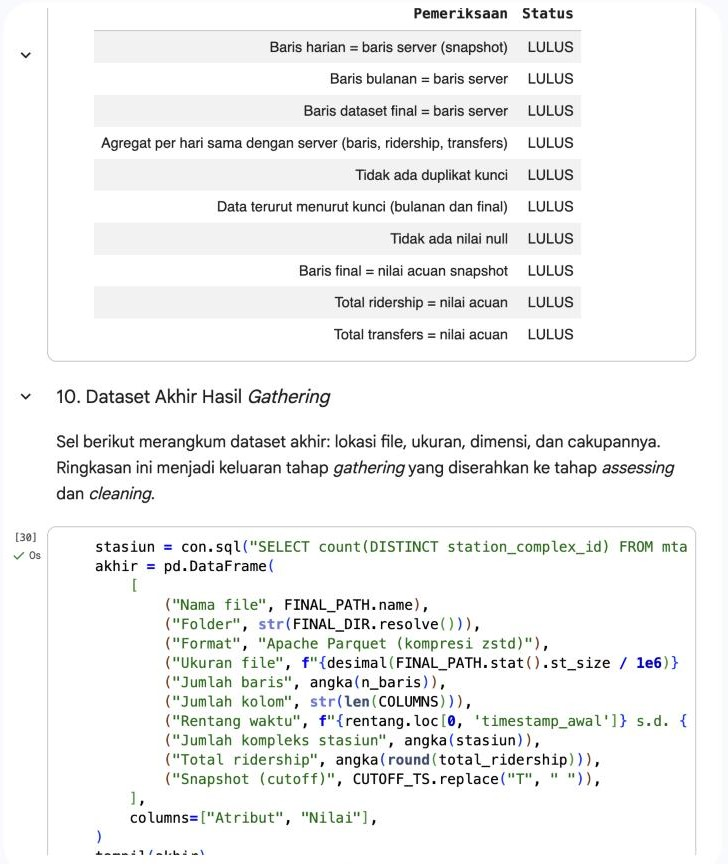
*Gambar 16. Ringkasan validasi: 10 dari 10 pemeriksaan lulus.*

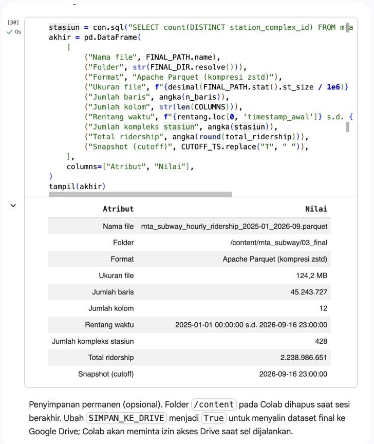
*Gambar 17. Ringkasan dataset akhir hasil *gathering*.*
